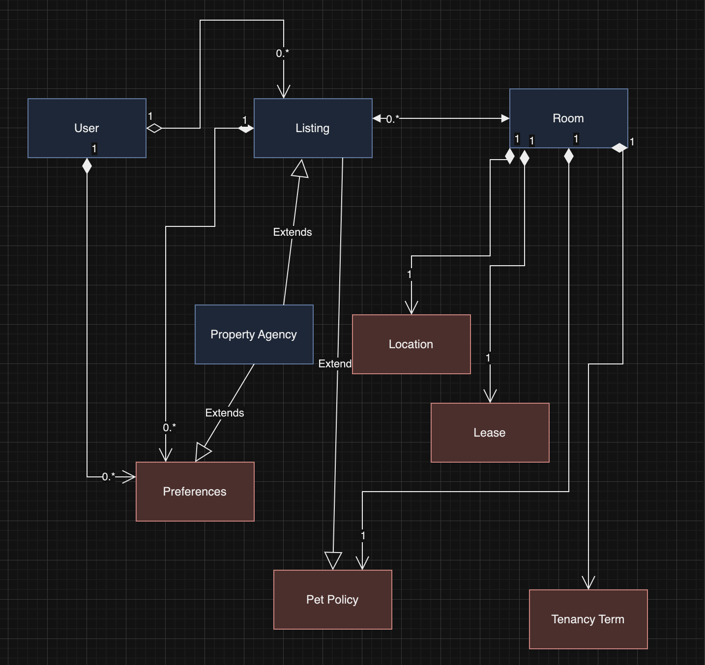

<p align="center">
  
</p>

# Find a Roomie

## Introduction
"Find a Roomie" is a web application designed to assist students across the globe in finding suitable accommodation. With a focus on ease of use and security, it offers a platform for users to list or search for rooms with just a few clicks.

## Key Features
- **User-Friendly Interface**: Intuitive design for effortless navigation.
- **Secure Login**: Ensures a safe, personalized user experience.
- **Dual Functionality**:
  - *List a Room*: Users can list their available rooms with detailed preferences.
  - *Find a Room*: Advanced search options with customizable filters.
- **Additional Implementations**: Blog integration, advanced security features, and confidentiality of personal information.


## Set up project in VS code:

1. **Clone the Repository:**
   ```bash
   git clone <repository-url>
   cd <repository-directory>
   ```

2. **Open Project in VS Code:**
   Open VS Code and navigate to File -> Open... or use the command line:
   ```bash
   code .
   ```

3. **Environment Variables**
   Ensure to set up these environment variables before running the application:
   - **MONGODB_URI**: MongoDB connection string for the 'roomies' database.
   - **PORT**: Port number on which the server will run (e.g., 3002).
   - **REACT_APP_API_BASE_URL**: Base URL for the API server (e.g., http://localhost:3002).

4. **Install Dependencies:**
   If your project requires dependencies (typically managed via `package.json` for Node.js projects, install them using:
   ```bash
   npm install-all   # From root folder for installing backend and frontend dependencies
   or
   npm install # To be run individually from backend and frontend
   ```

5. **Run Project**
   #### Start Backend Server
   To start the backend server, run:
   ```bash
   npm run start-backend # run from root folder
   ```
   This will start the server using `node backend/server.js`.

   #### Start Frontend Development Server
   To start the frontend development server, run:
   ```bash
   npm run start-frontend # run from root folder
   ```
   This will navigate to the `frontend` directory and start the development server using `npm start`.

   #### Start Both Backend and Frontend Concurrently
   To start both the backend and frontend concurrently (in development mode), run:
   ```bash
   npm start # run from root folder
   ```
   This uses `concurrently` to run both `npm run start-backend` and `npm run start-frontend` simultaneously.

6. **Git Workflow**

   1. Creating a new branch:
      ```bash
      git branch new-branch-name
      git checkout new-branch-name
      # or using a single command
      git checkout -b new-branch-name
      ```
   2. Commit Changes:
      
      ```bash
      git add .
      git commit -m "Your commit message"
      git push origin new-branch-name
      ```

These commands help in creating a new branch, switching to it, staging changes, committing them, and pushing the changes to the remote repository.


## Object Model Using Domain Driven Design
<p align="center">
  
</p>

# Find a Roomie - User Stories and Corresponding REST API Resources

- [API Testing Guide with Postman](documentation/api_testing_with_postman.md)
-  [User Stories](documentation/user_stories)
   - [User Story 1](documentation/user_stories/user_story_1.md)
   - [User Story 2](documentation/user_stories/user_story_2.md)
   - [User Story 3](documentation/user_stories/user_story_3.md)
   - [User Story 4](documentation/user_stories/user_story_4.md)
   - [User Story 5](documentation/user_stories/user_story_5.md)
   - [User Story 6](documentation/user_stories/user_story_6.md)
   - [User Story 7](documentation/user_stories/user_story_7.md)
   - [User Story 8](documentation/user_stories/user_story_8.md)
   - [User Story 9](documentation/user_stories/user_story_9.md)
- [Other Resources](documentation/other_resources.md)

# Team Maverick Team 35
- [Abhishek Chintapalli](www.linkedin.com/in/abhishekchintapalli)
- [Abhinav Chary Eeranti](www.linkedin.com/in/abhinaveeranti)
- [Tirdesh Pettugani](www.linkedin.com/in/tirdesh)
- [Sai Krishna Kotla](www.linkedin.com/in/saikrishnakotla)